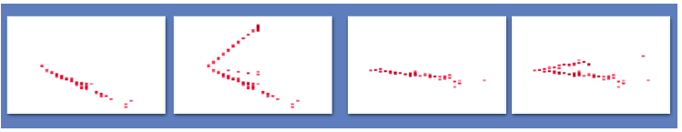

# ParticleTowerCNN
Context-Enriched and No-Context Particle Identification Networks

This repository contains the architectures and scripts used to train the model for the paper “Context-Enriched Particle Identification with a Convolutional Network for Neutrino Events”. This implementation was designed to classify particles in the NOvA experiment. The models here have four distinct inputs for inclusion of context information as well as separation of multiple views.



To train the model:
```bash
./train.sh
```

# Architecture

The model architecture used has one tower for each input. Each tower has a series of convolutional layers followed by a pooling layer. The final operation in each tower is an inception module, similar to that used by GoogLeNet. The output of each tower is concatenated together and the concatenated feature map is put through a final inception module. The resultant feature map is pooled into a flattened list. This list is put through a series of dense layers. The final dense layer has a softmax activation for the classification ouput.

# Training Datasets

The training and testing datasets are created in a LevelDB format. 2D histograms for each view are flattened to a 1D vector where the pixel values are stored as chars from 0-255. A caffe datum object is filled with these 1D vectors, label, number of channels (inputs), height and width of the images. The datum is serialized to a string where a unique number serialized into a key is assigned to it. The serialized key and datum output is then written to a LevelDB.

# Setup

This model was trained using caffe 1.0. Installation instructions for caffe can be found [here](http://caffe.berkeleyvision.org/installation.html).
